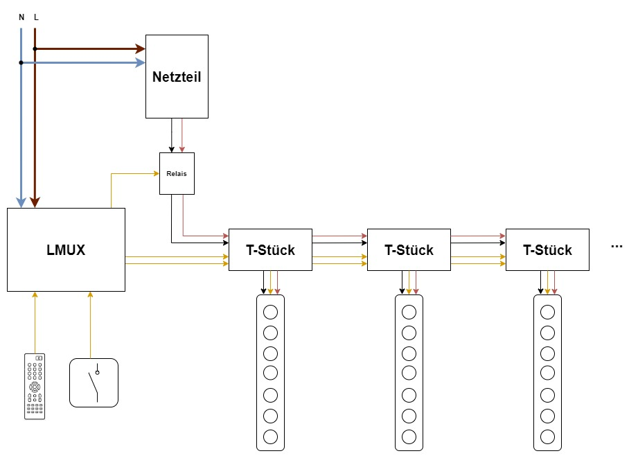
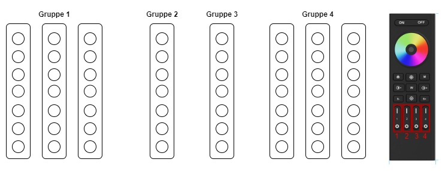
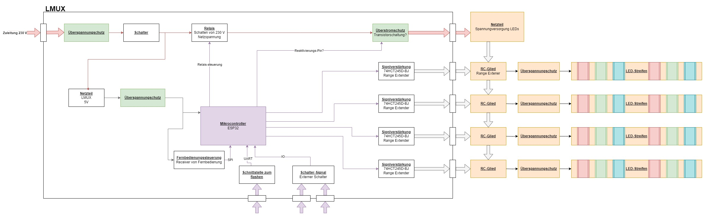

<!-- # LMUX
hier steht jetzt alles wichtige  -->

# LMUX
#### Blockschaltplan des gesamten Projekts:

### Beschreibung
Der LMUX soll bis zu 8 LED-Streifen unabhängig steuern können. Mithilfe verschiedener Steuermöglichkeiten sollen die Streifen Ein- und Ausgeschalten werden und Farbe, Helligkeit und verschiedene Animationen gesteuert werden können. Die verschiedene Animationen werden fest einprogrammiert, trotzdem soll es die Möglichkeit geben Aniamtionen hinzuzufügen. 
Die Einschaltanimaiton soll ebenso eingestellt werden können, sowie die Parameter dazu (Helligkeit, Geschwidnigkeit). Als Mikrocontroller wird ein ESP32 verwendet welche mit Neopixel Bus die LED-Streifen steuert. 
Als Schutz und Energie zu sparen kann über ein Relais, welches über den ESP gesteuert wird, das Netzteil geschaltet werden.

Die verschiedenen Streifen sollen in Gruppen eingeteilt werden können, wodurch sie sich gleich verhalten. Diese Gruppen können dann einzeln ausgewählt werden. 

Beispiel:

### Aufbau LMUX

### Wie sollen die LEDs gesteuert werden?

- **Fernbedienung:**
Standard 2,4 GHz [Fernbedienung](https://de.aliexpress.com/item/1005005821846889.html?spm=a2g0o.order_list.order_list_main.4.e1fd5c5f5rrFXV&gatewayAdapt=glo2deu) welche Helligkeit, Farbe, Animationen, etc. steuert. Das Signal vom [Controller](https://de.aliexpress.com/item/1005005925640645.html?spm=a2g0o.order_list.order_list_main.53.e1fd5c5f5rrFXV&gatewayAdapt=glo2deu) soll vom ESP über SPI abgefangen werden und verarbeitet werden (siehe Code_SPI).
- **Taster:** Normal Taster welcher alle Streifen Einschalten, Auschalten, Dimmen (Long Press) und Animationen steuern kann (Double Press).
- **Drehregler:** Taster mit zusätzlicher  Drehfunktion 
- **Handy:** Zukunftsmusik

